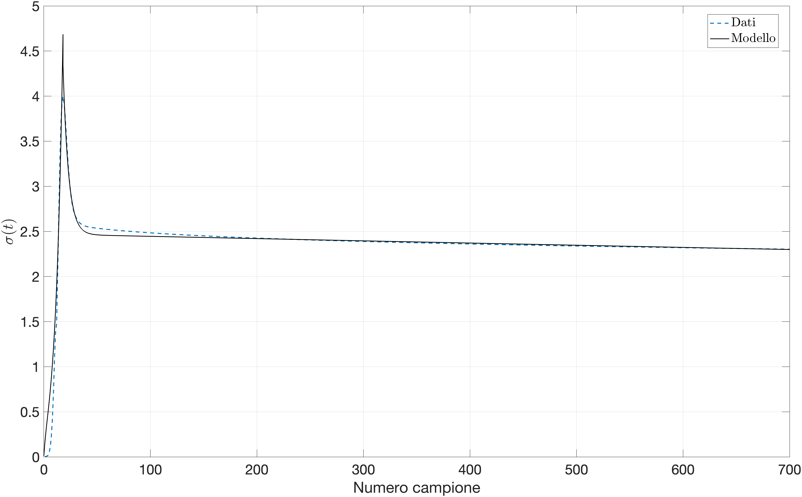

# BioEngineering laboratory

## Description
This course provides an in-depth exploration into various aspects of bioengineering, focusing on experimental techniques and data analysis.
Here are collected all the resourced that our group produced. 

## Viscoelastic Models of Biological Tissues 
This module delves into the analysis and modeling of viscoelastic properties exhibited by biological tissues.
Analysis for modelling responses to positional and force inputs within viscoelastic bodies. 
The analysis culminated with the fitting of the **QuasiLinear viscoelasticity model**:
 
In order to find the best coefficient that reppresented the model behaviour. 

## Anthropometry and Biomechanics of Movement 
The focus of this module is on anthropometry and the biomechanics of human movement.
Topics like the principles of anthropometry and their application in analyzing human body dimensions are covered.
Furthermore, we'll dive into biomechanical analyses of walking, including the estimation of anthropometric parameters and calculation of walking kinematics. 

## Models for Human Body Statics 
In this final module, we will explore models for understanding the statics of the human body, particularly focusing on the musculoskeletal system. 
We will calculate muscle actions and joint forces.[...]
